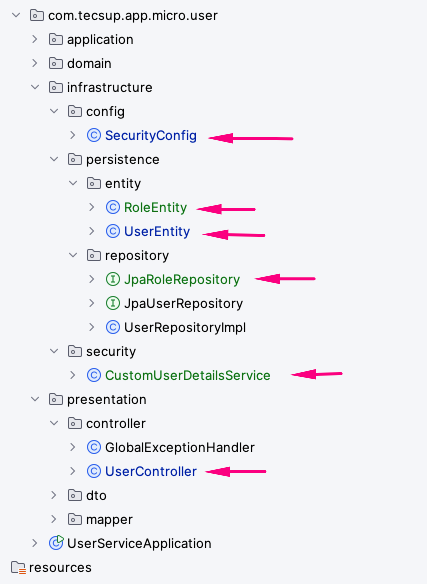

#  Microservicio User-Service - Seguridad y Despliegue en Kubernetes



## 1.- Modificar aplicación para agregar seguridad con Spring Security

### 1.1.- Agregar Spring Security

```xml
    <dependency>
        <groupId>org.springframework.boot</groupId>
        <artifactId>spring-boot-starter-security</artifactId>
    </dependency>

    <dependency>
        <groupId>org.springframework.security</groupId>
        <artifactId>spring-security-test</artifactId>
        <scope>test</scope>
    </dependency>
```
### 1.2.- Creación de clases

#### 1.2.1. Entidades

- RoleEntity.java
```java
package com.tecsup.app.micro.delivery.infrastructure.persistence.entity;

import jakarta.persistence.*;
import lombok.AllArgsConstructor;
import lombok.Builder;
import lombok.Data;
import lombok.NoArgsConstructor;

import java.time.LocalDateTime;

/**
 * Entidad JPA de Rol
 * Sesión 1 - Módulo 4: Seguridad en Microservicios
 */
@Entity
@Table(name = "roles")
@Data
@Builder
@NoArgsConstructor
@AllArgsConstructor
public class RoleEntity {

    @Id
    @GeneratedValue(strategy = GenerationType.IDENTITY)
    private Long id;

    @Column(nullable = false, unique = true, length = 50)
    private String name;

    @Column(length = 200)
    private String description;

    @Column(name = "created_at", nullable = false, updatable = false)
    private LocalDateTime createdAt;

    @PrePersist
    protected void onCreate() {
        createdAt = LocalDateTime.now();
    }
}

```

- UserEntity.java (agregar campos password y enabled)

```java
package com.tecsup.app.micro.delivery.infrastructure.persistence.entity;

import jakarta.persistence.*;
import lombok.AllArgsConstructor;
import lombok.Builder;
import lombok.Data;
import lombok.NoArgsConstructor;

import java.time.LocalDateTime;
import java.util.HashSet;
import java.util.Set;

/**
 * Entidad JPA de Usuario
 * Esta clase pertenece a la capa de infraestructura y maneja la persistencia
 */
@Entity
@Table(name = "deliveries", indexes = {
        @Index(name = "idx_users_email", columnList = "email", unique = true),
        @Index(name = "idx_users_name", columnList = "name"),
        @Index(name = "idx_users_created_at", columnList = "created_at")
})
@Data
@Builder
@NoArgsConstructor
@AllArgsConstructor
public class UserEntity {

    @Id
    @GeneratedValue(strategy = GenerationType.IDENTITY)
    private Long id;

    @Column(nullable = false, length = 100)
    private String name;

    @Column(nullable = false, unique = true, length = 100)
    private String email;

    @Column(length = 20)
    private String phone;

    @Column(length = 255)
    private String address;

    // ========================================
    // NUEVOS CAMPOS - Seguridad (Sesión 1)
    // ========================================

    @Column(nullable = false, length = 100)
    private String password;

    @Builder.Default
    @Column(nullable = false)
    private Boolean enabled = true;

    @Builder.Default
    @ManyToMany(fetch = FetchType.EAGER)
    @JoinTable(
            name = "user_roles",
            joinColumns = @JoinColumn(name = "user_id"),
            inverseJoinColumns = @JoinColumn(name = "role_id")
    )
    private Set<RoleEntity> roles = new HashSet<>();

    // ========================================


    @Column(name = "created_at", nullable = false, updatable = false)
    private LocalDateTime createdAt;

    @Column(name = "updated_at")
    private LocalDateTime updatedAt;

    @PrePersist
    protected void onCreate() {
        LocalDateTime now = LocalDateTime.now();
        createdAt = now;
        updatedAt = now;
    }

    @PreUpdate
    protected void onUpdate() {
        updatedAt = LocalDateTime.now();
    }
}

```

#### 1.2.2. Repositorios

- JpaRoleRepository.java

```java

package com.tecsup.app.micro.delivery.infrastructure.persistence.repository;

import org.springframework.data.jpa.repository.JpaRepository;

import java.util.Optional;

/**
 * Repositorio JPA de Rol
 * Sesión 1 - Módulo 4: Seguridad en Microservicios
 */
public interface JpaRoleRepository extends JpaRepository<RoleEntity, Long> {

    Optional<RoleEntity> findByName(String name);
}

```

#### 1.2.3. Autenticación contra base de datos

- CustomUserDetailsService.java

```java

package com.tecsup.app.micro.delivery.infrastructure.security;

import com.tecsup.app.micro.delivery.infrastructure.persistence.entity.DeliveryEntity;
import com.tecsup.app.micro.delivery.infrastructure.persistence.entity.UserEntity;
import com.tecsup.app.micro.delivery.infrastructure.persistence.repository.JpaDeliveryRepository;
import lombok.RequiredArgsConstructor;
import lombok.extern.slf4j.Slf4j;
import org.springframework.security.core.GrantedAuthority;
import org.springframework.security.core.authority.SimpleGrantedAuthority;
import org.springframework.security.core.userdetails.User;
import org.springframework.security.core.userdetails.UserDetails;
import org.springframework.security.core.userdetails.UserDetailsService;
import org.springframework.security.core.userdetails.UsernameNotFoundException;
import org.springframework.stereotype.Service;
import org.springframework.transaction.annotation.Transactional;

import java.util.List;
import java.util.stream.Collectors;

/**
 * Servicio de autenticación que carga usuarios desde userdb (PostgreSQL)
 *
 * Paquete: com.tecsup.app.micro.delivery.infrastructure.security
 * Sesión 1 - Módulo 4: Seguridad en Microservicios
 *
 * Usa el email como username para autenticación.
 * Lee los roles desde la tabla user_roles (relación N:N).
 * Los passwords están almacenados con BCrypt en la tabla deliveries.
 */
@Service
@RequiredArgsConstructor
@Slf4j
public class CustomUserDetailsService implements UserDetailsService {

    private final JpaDeliveryRepository jpaDeliveryRepository;

    /**
     * Carga un usuario por email desde userdb.
     * Spring Security invoca este método automáticamente durante la autenticación.
     *
     * @param email El email del usuario (usado como username)
     * @return UserDetails con email, password (BCrypt) y roles
     * @throws UsernameNotFoundException si el email no existe en la BD
     */
    @Override
    @Transactional(readOnly = true)
    public UserDetails loadUserByUsername(String email) throws UsernameNotFoundException {
        log.info("Autenticando usuario con email: {}", email);

        DeliveryEntity deliveryEntity = jpaUserRepository.findByEmail(email)
                .orElseThrow(() -> {
                    log.warn("Usuario no encontrado: {}", email);
                    return new UsernameNotFoundException("Usuario no encontrado con email: " + email);
                });

        // Convertir roles de la BD a GrantedAuthority de Spring Security
        // Ejemplo: RoleEntity(name="ROLE_ADMIN") → SimpleGrantedAuthority("ROLE_ADMIN")
        List<GrantedAuthority> authorities = deliveryEntity.getRoles().stream()
                .map(role -> new SimpleGrantedAuthority(role.getName()))
                .collect(Collectors.toList());

        log.info("Usuario autenticado: {} con roles: {}", email, authorities);

        return new User(
                deliveryEntity.getEmail(),       // username = email
                deliveryEntity.getPassword(),    // password BCrypt desde BD
                deliveryEntity.getEnabled(),     // enabled
                true,                        // accountNonExpired
                true,                        // credentialsNonExpired
                true,                        // accountNonLocked
                authorities                  // roles
        );
    }
}

```
#### 1.2.4. Configuración de seguridad

- SecurityConfig.java

```java
package com.tecsup.app.micro.delivery.infrastructure.config;

import lombok.RequiredArgsConstructor;
import org.springframework.context.annotation.Bean;
import org.springframework.context.annotation.Configuration;
import org.springframework.http.HttpStatus;
import org.springframework.security.authentication.AuthenticationManager;
import org.springframework.security.config.annotation.authentication.configuration.AuthenticationConfiguration;
import org.springframework.security.config.annotation.method.configuration.EnableMethodSecurity;
import org.springframework.security.config.annotation.web.builders.HttpSecurity;
import org.springframework.security.config.annotation.web.configuration.EnableWebSecurity;
import org.springframework.security.config.http.SessionCreationPolicy;
import org.springframework.security.crypto.bcrypt.BCryptPasswordEncoder;
import org.springframework.security.crypto.password.PasswordEncoder;
import org.springframework.security.web.SecurityFilterChain;

/**
 * Configuración de Spring Security para delivery-service
 *
 * Paquete: com.tecsup.app.micro.delivery.infrastructure.config
 * Sesión 1: HTTP Basic + roles
 * Sesión 2: Se reemplaza HTTP Basic por JWT (descomentar líneas marcadas)
 *
 * Endpoints:
 *   POST /api/auth/login       → público (Sesión 2)
 *   POST /api/auth/register    → público (Sesión 2)
 *   GET  /api/deliveries/health     → público
 *   GET  /api/deliveries/me         → autenticado
 *   GET/POST/PUT/DELETE /api/deliveries/** → ADMIN
 *   Actuator /actuator/health  → público
 */
@Configuration
@EnableWebSecurity
@EnableMethodSecurity  // Habilita @PreAuthorize, @Secured
@RequiredArgsConstructor
public class SecurityConfig {

    private final CustomUserDetailsService customUserDetailsService;

    @Bean
    public SecurityFilterChain userServiceSecurity(HttpSecurity http) throws Exception {
        http
                // Deshabilitar CSRF (no necesario en APIs REST stateless)
                .csrf(csrf -> csrf.disable())

                // Política de sesión: STATELESS (sin estado en servidor)
                .sessionManagement(session ->
                        session.sessionCreationPolicy(SessionCreationPolicy.STATELESS)
                )

                // Reglas de autorización por URL
                .authorizeHttpRequests(auth -> auth

                        // Endpoints públicos
                        .requestMatchers("/api/auth/**").permitAll()
                        .requestMatchers("/api/deliveries/health").permitAll()
                        .requestMatchers("/actuator/health/**").permitAll()

                        // Solo ADMIN puede gestionar usuarios
                        .requestMatchers("/api/deliveries/**").hasRole("ADMIN")

                        // Todo lo demás requiere autenticación
                        .anyRequest().authenticated()
                )

                // =============================================
                // Sesión 1: HTTP Basic (comentar en Sesión 2)
                // =============================================
                .httpBasic(basic -> basic
                        .authenticationEntryPoint((request, response, authException) -> {
                            response.setStatus(HttpStatus.UNAUTHORIZED.value());
                            response.setContentType("application/json");
                            response.getWriter().write(
                                    """
                                                 {
                                                     "error"  : "No autenticado", 
                                                     "status" : 401,
                                                     "message": "Debes autenticarte para acceder a este recurso"
                                                  }
                                            """);
                        })
                )

                // Manejo de errores de autorización (403)
                .exceptionHandling(ex -> ex
                        .accessDeniedHandler((request, response, accessDeniedException) -> {
                            response.setStatus(HttpStatus.FORBIDDEN.value());
                            response.setContentType("application/json");
                            response.getWriter().write(
                                    """
                                              {
                                                  "error"   : "Acceso denegado", 
                                                  "status"  : 403,
                                                  "message" : "No tienes permisos para acceder a este recurso"
                                              }
                                            """);
                        })
                );

        return http.build();
    }

    @Bean
    public PasswordEncoder passwordEncoder() {
        return new BCryptPasswordEncoder();
    }

    @Bean
    public AuthenticationManager authenticationManager(
            AuthenticationConfiguration authenticationConfiguration) throws Exception {
        return authenticationConfiguration.getAuthenticationManager();
    }

}

```

#### 1.2.5. Controladores con @PreAuthorize

- UserController.java

```java
package com.tecsup.app.micro.delivery.presentation.controller;

import com.tecsup.app.micro.delivery.application.service.DeliveryApplicationService;
import com.tecsup.app.micro.delivery.domain.model.Delivery;
import com.tecsup.app.micro.delivery.domain.model.User;
import com.tecsup.app.micro.delivery.presentation.dto.CreateDeliveryRequest;
import com.tecsup.app.micro.delivery.presentation.dto.UpdateDeliveryRequest;
import com.tecsup.app.micro.delivery.presentation.dto.UpdateUserRequest;
import com.tecsup.app.micro.delivery.presentation.dto.DeliveryResponse;
import com.tecsup.app.micro.delivery.presentation.mapper.DeliveryDtoMapper;
import jakarta.validation.Valid;
import lombok.RequiredArgsConstructor;
import lombok.extern.slf4j.Slf4j;
import org.springframework.http.HttpStatus;
import org.springframework.http.ResponseEntity;
import org.springframework.security.access.prepost.PreAuthorize;
import org.springframework.security.core.Authentication;
import org.springframework.web.bind.annotation.*;

import java.util.List;

/**
 * Controlador REST de Usuarios
 * MODIFICADO en Módulo 4 - Sesión 1: Se agregan anotaciones @PreAuthorize
 *
 * Reglas de acceso:
 *   GET    /api/deliveries          → ADMIN
 *   GET    /api/deliveries/{id}     → ADMIN
 *   GET    /api/deliveries/me       → Autenticado (cualquier rol)
 *   POST   /api/deliveries          → ADMIN
 *   PUT    /api/deliveries/{id}     → ADMIN
 *   DELETE /api/deliveries/{id}     → ADMIN
 *   GET    /api/deliveries/health   → Público
 */
@RestController
@RequestMapping("/api/deliveries")
@RequiredArgsConstructor
@Slf4j
public class UserController {

    private final DeliveryApplicationService deliveryApplicationService;
    private final DeliveryDtoMapper deliveryDtoMapper;

    /**
     * Obtiene todos los usuarios (solo ADMIN)
     */
    @GetMapping
    @PreAuthorize("hasRole('ADMIN')")
    public ResponseEntity<List<DeliveryResponse>> getAllUsers() {
        log.info("REST request to get all deliveries");
        List<Delivery> deliveries = userApplicationService.getAllUsers();
        return ResponseEntity.ok(userDtoMapper.toResponseList(deliveries));
    }

    /**
     * TOD
     * Obtiene el usuario autenticado actual
     * Sesión 2: usa el email del JWT para identificar al usuario
     */
    @GetMapping("/me")
    @PreAuthorize("isAuthenticated()")
    public ResponseEntity<DeliveryResponse> getCurrentUser(Authentication authentication) {
        log.info("REST request to get current delivery: {}", authentication.getName());
        // authentication.getName() retorna el email (subject del JWT)
        // Se podría buscar por email en lugar de por ID
        return ResponseEntity.ok(
                DeliveryResponse.builder()
                        .email(authentication.getName())
                        .name(authentication.getName())
                        .build()
        );
    }

    /**
     * Obtiene un usuario por ID (solo ADMIN)
     */
    @GetMapping("/{id}")
    @PreAuthorize("hasRole('ADMIN')")
    public ResponseEntity<DeliveryResponse> getUserById(@PathVariable Long id) {
        log.info("REST request to get delivery by id: {}", id);
        Delivery delivery = userApplicationService.getUserById(id);
        return ResponseEntity.ok(userDtoMapper.toResponse(delivery));
    }

    /**
     * Crea un nuevo usuario (solo ADMIN)
     */
    @PostMapping
    @PreAuthorize("hasRole('ADMIN')")
    public ResponseEntity<DeliveryResponse> createUser(@Valid @RequestBody CreateDeliveryRequest request) {
        log.info("REST request to create delivery: {}", request.getEmail());
        Delivery delivery = userDtoMapper.toDomain(request);
        Delivery createdDelivery = userApplicationService.createUser(delivery);
        return ResponseEntity.status(HttpStatus.CREATED)
                .body(userDtoMapper.toResponse(createdDelivery));
    }

    /**
     * Actualiza un usuario existente (solo ADMIN)
     */
    @PutMapping("/{id}")
    @PreAuthorize("hasRole('ADMIN')")
    public ResponseEntity<DeliveryResponse> updateUser(
            @PathVariable Long id,
            @Valid @RequestBody UpdateDeliveryRequest request) {
        log.info("REST request to update delivery with id: {}", id);
        Delivery delivery = userDtoMapper.toDomain(request);
        Delivery updatedDelivery = userApplicationService.updateUser(id, delivery);
        return ResponseEntity.ok(userDtoMapper.toResponse(updatedDelivery));
    }

    /**
     * Elimina un usuario (solo ADMIN)
     */
    @DeleteMapping("/{id}")
    @PreAuthorize("hasRole('ADMIN')")
    public ResponseEntity<Void> deleteUser(@PathVariable Long id) {
        log.info("REST request to delete delivery with id: {}", id);
        userApplicationService.deleteUser(id);
        return ResponseEntity.noContent().build();
    }

    /**
     * Endpoint de salud (público, sin autenticación)
     */
    @GetMapping("/health")
    public ResponseEntity<String> health() {
        return ResponseEntity.ok("User Service running with Clean Architecture!");
    }
}

```

### 1.3.- Verificar en localhost

- Ejecutar la aplicación y probar los endpoints con Postman o curl.
```
# Sin autenticación → 401
curl http://localhost:8081/api/deliveries

# Con ADMIN → 200
curl -u juan.perez@example.com:admin123 http://localhost:8081/api/deliveries

# Con USER intentando acceso ADMIN → 403
curl -u maria.garcia@example.com:user123 http://localhost:8081/api/deliveries
```

## 2.- Desplegar en Kubernetes con seguridad

### 2.1.- Crear roles y usuarios en la base de datos
- Ejecutar el script V4__ADD_SECURITY_TABLES.sql  y V5__INSERT_DEFAULT_USERS.sql en PostgreSQL para crear las tablas de seguridad y agregar un usuario ADMIN y otro USER.

### 2.2.- Construir imagen Docker y probar localmente (ver README.md)

#### Constuir imagen

```
# Compilar el proyecto (si es necesario)
mvn clean package -DskipTests

# Construir imagen
docker build -t delivery-service:1.0 .

# Este proceso toma 2-3 minutos la primera vez
# Ver progreso: [1/2] STEP X/Y...

# Verificar imagen creada
docker images | grep delivery-service

# Deberías ver:
# delivery-service   1.0   abc123def456   1 minute ago   230MB

```

#### Probar la imagen Docker

```
# Ejecutar contenedor de la app
docker run -p 8081:8081 \
-e SPRING_PROFILES_ACTIVE=kubernetes \
-e DB_URL=jdbc:postgresql://host.docker.internal:5434/userdb \
-e DB_USERNAME=postgres \
-e DB_PASSWORD=postgres \
delivery-service:1.0


# En otra terminal, probar

# Health check
curl http://localhost:8081/actuator/health

# Respuesta esperada:
# {"status":"UP","groups":["liveness","readiness"]}

# Listar usuarios
curl http://localhost:8081/api/deliveries

```

### 2.3.- Desplegar en Kubernetes (ver README.md)

- En caso se haya modificado el código después del despliegue inicial, reiniciar el deployment para aplicar los cambios:
```
 kubectl rollout restart deployment delivery-service -n delivery-service
```
- Verificar despliegue, servicio y pods:
```
# Verificar despliegue
kubectl get deployments -n delivery-service

# Verificar servicio
kubectl get service -n delivery-service

# Verificar pods
kubectl get pods  -n delivery-service

# Ver detalles de un pod
kubectl describe pod <POD_NAME> -n delivery-service

# Ver logs en tiempo real
kubectl logs -f <POD_NAME> -n delivery-service

```


### 2.4.- Probar autenticación en Kubernetes

```
# Sin autenticación → 401
curl http://localhost:30081/api/deliveries

# Con ADMIN → 200
curl -u juan.perez@example.com:admin123 http://localhost:30081/api/deliveries

# Con USER intentando acceso ADMIN → 403
curl -u maria.garcia@example.com:user123 http://localhost:30081/api/deliveries
```
